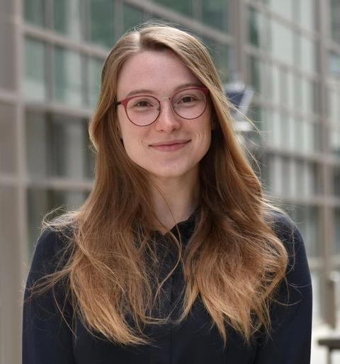

## About the Forum

Robot control has long been a foundational pillar of robotics. Yet its visibility as a distinct discipline is fading. Our [TC Spotlight article](https://doi.org/10.1109/MRA.2025.3560465) in IEEE Robotics & Automation Magazine shows that control has not shrunk, it has scattered: 13 of 20 RA-L subject areas now contain control keywords, and control-focused sessions at major conferences have given way to broader topic areas. A control paper today often ends up in a learning or application session, in front of an audience that came for something else.

The consequences are visible. Researchers, especially early-career ones, feel isolated and worry that their work is perceived as peripheral or outdated. Beyond academia, the trend affects how funding agencies prioritize foundational versus applied research, how the robotics workforce is trained, and ultimately how reliable, safe, and trustworthy future robotic systems will be. Control research also requires comparatively few material investments, making it one of the most accessible entry points into robotics for groups with limited resources; a decline in its visibility therefore has implications for the inclusivity and global accessibility of the field.

This forum treats these trends as policy and community challenges rather than technical problems. It brings together senior researchers, industry leaders, and RAS leadership to examine three questions:

> * Is robotics underinvesting in its theoretical and control-theoretic foundations, and what evidence supports this claim?
> * How do current funding structures, conference organization, and publication incentives shape the research landscape for robot control?
> * What concrete actions can the community take to sustain foundational robot control research, particularly for early-career researchers and groups with limited resources?

The forum closes a three-event initiative of the TC in 2026. The ECC 2026 workshop (Reykjavik, July 7) and the IFAC World Congress workshop (Busan, August) collected the open scientific challenges in robot control. The IROS forum turns to the community itself and asks how to rebuild a shared home for the people working on them. It will conclude with actionable recommendations for conference organizers, funding agencies, and the RAS community, to be published as a position paper.

## Program

  

2:30&ndash;2:40

Opening

  
Block 1Robot Control Today and Tomorrow

  

2:40&ndash;3:40

Perspective talks (10 min each) by academic and industry speakers &mdash; see below

  

3:40&ndash;3:55

Coffee break

  
Block 2Rebuilding a Home for Robot Control

  

3:55&ndash;4:05

Marcelo Ang &mdash; Chair, IEEE RAS Robotics Foundation Cluster

  

4:05&ndash;4:15

Hugo Rodrigue &mdash; IEEE RAS Vice President of Technical Activities

  

4:15&ndash;4:55

Panel discussion with all speakers: structural changes, visibility for early-career researchers, and global accessibility

  
ClosingRecommendations & next steps

  

4:55&ndash;5:00

Summary, actionable recommendations, and announcement of the planned position paper

Perspective talks are 10-minute personal views, not technical presentations. Each speaker closes with concrete steps for the next few years; all speakers join the closing panel. Order of Block 1 talks to be announced.

## Speakers

  
Sehoon OhDGIST, South Korea

  
Bruno Vilhena AdornoThe University of Manchester, UK

  
Sylvia HerbertUniversity of California San Diego, USA tbc

  
Michael LutterBoston Dynamics, USA tbc

  
Sven ParuselFranka Robotics, Germany

  
Nicholas PaineApptronik, USA tbc

  
Marcelo AngNational University of Singapore &mdash; Chair, IEEE RAS Robotics Foundation Cluster

  
Hugo RodrigueSungkyunkwan University &mdash; IEEE RAS VP of Technical Activities

## What We Ask of Speakers

* **Academic speakers**: how the fragmentation and declining visibility of control affect their research area, their students, and where the field is heading, including whether foundational control work has become harder to fund.
* **Industry speakers**: what industry needs from robot control today, whether academia is producing it, and what the gap looks like in practice, in hiring, in problems solved in-house, and in research that is missing.
* **RAS leadership**: the view from Society leadership for the researchers in the room: does RAS see the dispersion of control as a problem, does it still consider foundational disciplines essential in a period of rapid growth in learning-based work, and what does it expect a community like ours to do.

## Organizers

Co-chairs of the IEEE RAS Technical Committee on Robot Control:

  

    
    

      <h3>Manuel Keppler Primary contact</h3>
      <h4>German Aerospace Center (DLR), Germany</h4>
    

  

  

    
    

      <h3>Cosimo Della Santina</h3>
      <h4>TU Delft, The Netherlands</h4>
    

  

  

    
    

      <h3>Sylvia Herbert</h3>
      <h4>University of California San Diego, USA</h4>
    

  

  

    
    

      <h3>Kaoru Yamamoto</h3>
      <h4>Kyushu University, Japan</h4>
    

  

  

    
    

      <h3>Fumiya Matsuzaki</h3>
      <h4>Kyushu University, Japan</h4>
    

  

  

    
    

      <h3>Yuhe Gong</h3>
      <h4>University of Nottingham, UK</h4>
    

  

  

    
    

      <h3>Daniele Caradonna</h3>
      <h4>Scuola Superiore Sant'Anna, Italy</h4>
    

  

### Contact
[manuel.keppler@dlr.de](mailto:manuel.keppler@dlr.de)

## Further Reading

* [TC Spotlight: Robot Control](https://doi.org/10.1109/MRA.2025.3560465), IEEE Robotics & Automation Magazine, June 2025
* TC Website: [IEEE RAS Technical Committee on Robot Control](https://ieee-ras-robot-control.github.io/) 
